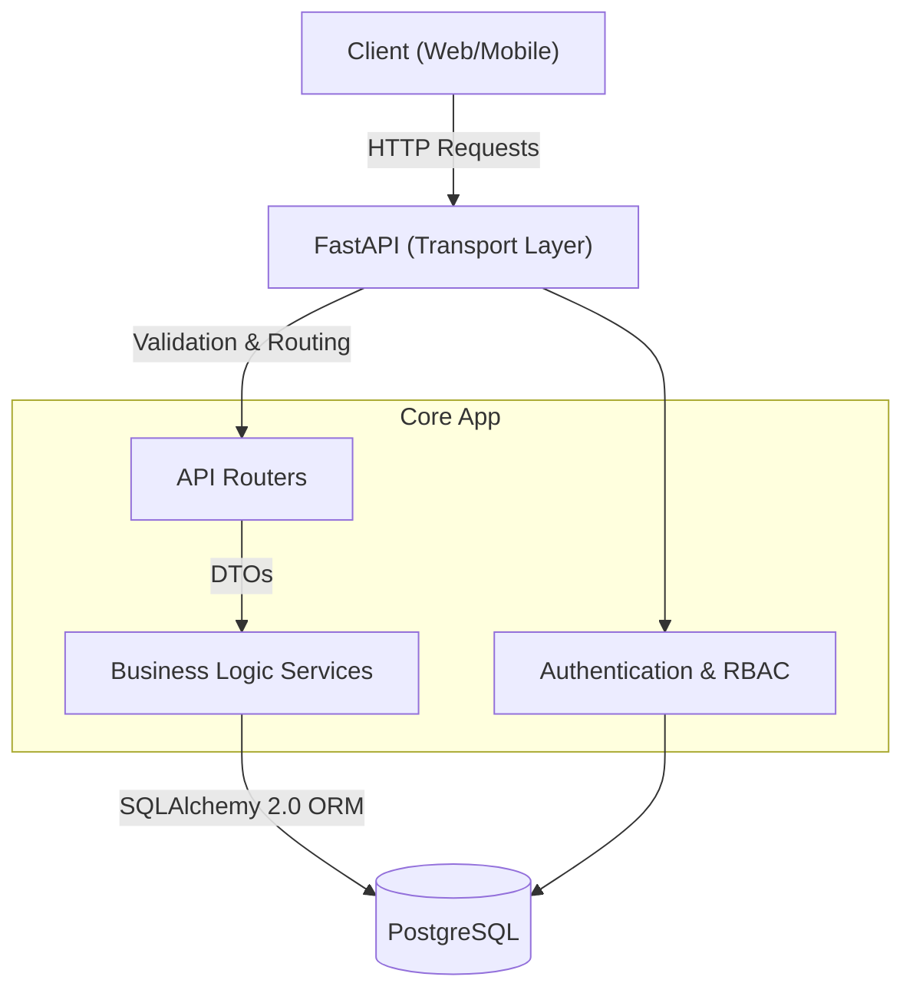

# 🚀 Enterprise Task Management API


A production-ready, high-performance RESTful API for managing tasks, projects, and cross-functional teams. Built with a focus on strict security, resilient database access, and clean architectural boundaries.

---

## 🌟 Key Features

### 🛡️ Enterprise-Grade Security
* **Robust Authentication Flow**: Implements dual-token architecture using short-lived JWT access tokens and stateful, opaque refresh tokens stored via Argon2/bcrypt hashing.
* **Dual-Layer Authorization**:
  * **Global RBAC**: Database-driven Role-Based Access Control allowing global permissions (e.g., system-wide Admin overrides).
  * **Project-Level Permissions**: Scoped workspace access ensuring users can only interact with projects and tasks they have explicit membership in.
* **Input Defense**: Strict validation using Pydantic V2 schemas enforcing password complexity, boundaries, and type safety, preventing mass-assignment and injection attacks.

### ⚡ Resilient Architecture
* **Advanced Database Pooling**: Optimized SQLAlchemy `create_engine` configuration with custom connection pool sizing, overflow management, and pre-ping connectivity checks to prevent stale connections and connection exhaustion under load.
* **Zero N+1 Query Problem**: Utilizes optimized `selectinload` eager loading for user roles and permissions, eliminating database bottlenecks during authentication.
* **Centralized Exception Handling**: All business logic raises standardized custom exceptions (e.g., `PermissionDeniedException`, `TaskNotFoundException`) which are caught by a global FastAPI exception handler, ensuring clients never see raw 500 stack traces and always receive strictly compliant RFC 7235 REST responses.

### 📈 Scalable API Design
* **URI Versioning**: All endpoints are cleanly separated under an `/api/v1` namespace to ensure seamless forward-compatibility.
* **Pagination**: Enforced generic, memory-safe pagination (`PaginatedResponse`) with configurable offset/limit querying to protect list endpoints (`/projects`, `/users`, `/tasks`) against unbounded data retrieval.
* **Modern SQLAlchemy 2.0**: Exclusively uses the modern SQLAlchemy `select()` API for cleaner, more predictable ORM querying.

---

## 🏗️ Architecture



---

## 🛠️ Technology Stack

* **Framework:** [FastAPI](https://fastapi.tiangolo.com/) (Python 3.10+)
* **Database:** PostgreSQL
* **ORM:** [SQLAlchemy 2.0](https://www.sqlalchemy.org/)
* **Migrations:** Alembic
* **Data Validation:** Pydantic V2 & `pydantic-settings`
* **Security:** PyJWT, `pwdlib` (Argon2 recommended)
* **Code Quality:** Ruff, Mypy, Pytest

---

## 📁 Project Structure

The codebase strictly adheres to Separation of Concerns (SoC), isolating HTTP transport logic from core business logic.

```text
app/
├── auth/           # JWT generation, token rotation, and hashing utilities
├── authorization/  # RBAC models and permission dependency injection
├── core/           # Environment config, constants, and custom exception hierarchy
├── db/             # Database connection pooling and base models
├── models/         # SQLAlchemy ORM models (Database Layer)
├── routers/        # FastAPI API endpoints (Transport Layer)
├── schemas/        # Pydantic models for serialization/validation
├── scripts/        # CLI scripts (e.g., create_admin.py)
├── services/       # Core business logic and database interactions
└── main.py         # App initialization, exception handlers, and lifespan
```

---

## 🚦 Local Setup & Installation

### 1. Prerequisites
* Python 3.10+
* PostgreSQL running locally or via Docker

### 2. Environment Configuration
Clone the repository and create your local environment file:

```bash
cp .env.example .env
```

Open `.env` and configure your settings:
* Update `DATABASE_URL` with your PostgreSQL credentials.
* Generate a strong 256-bit hex secret for `SECRET_KEY`:
  ```bash
  python -c "import secrets; print(secrets.token_hex(32))"
  ```

### 3. Install Dependencies
It is recommended to use a virtual environment:

```bash
python -m venv .venv
source .venv/bin/activate  # On Windows: .venv\Scripts\activate
pip install -r requirements.txt
```

### 4. Database Migrations
Generate and apply the initial schema using Alembic:

```bash
alembic upgrade head
```

### 5. Seed an Admin User
Before interacting with the API, create a root admin user to bootstrap the system:

```bash
python -m app.scripts.create_admin
```

### 6. Start the Server
Run the FastAPI application via Uvicorn:

```bash
python -m app.main
```
* **API Endpoints:** `http://127.0.0.1:8000`
* **Interactive Swagger UI:** `http://127.0.0.1:8000/docs`
* **ReDoc UI:** `http://127.0.0.1:8000/redoc`

---

## 🔗 Core API Modules

The API is versioned under `/api/v1` and provides robust capabilities across several modules:

* **Users (`/api/v1/users`)**: Authentication, user profile management, and global RBAC assignment.
* **Projects (`/api/v1/projects`)**: Workspace creation, project updates, and project-level user access control.
* **Tasks (`/api/v1/tasks`)**: Task tracking, assignment, status updates, and filtering.

> **Note:** Accessing endpoints requires proper authentication (Bearer token). Certain administrative endpoints are protected by `Global Admin` roles.

---

## 📝 Code Quality & Tooling

This project utilizes modern Python tooling for code quality and correctness:

* **Ruff**: For lightning-fast linting and formatting. Run with:
  ```bash
  ruff check .
  ruff format .
  ```
* **Mypy**: For strict static type checking (with `pydantic.mypy` plugins enabled). Run with:
  ```bash
  mypy .
  ```
* **Pytest**: For testing configurations defined in `pyproject.toml`. Run the suite with:
  ```bash
  pytest
  ```
* **Coverage**: For checking test coverage:
  ```bash
  coverage run -m pytest
  coverage report
  ```

---

## 🚀 Deployment Recommendations

For production environments, ensure you follow these best practices:
1. **WSGI/ASGI Server**: Use `gunicorn` with `uvicorn` workers behind a reverse proxy like Nginx or Traefik.
2. **Environment Variables**: Never hardcode secrets. Inject `.env` values dynamically.
3. **Database Pooling**: Ensure connection pools are properly tuned (like `PgBouncer`) alongside SQLAlchemy's internal pooling.
4. **SSL/TLS**: Enforce HTTPS via reverse proxy and secure your cookies/tokens.

---

## 🤝 Contributing

1. Fork the repository
2. Create your feature branch (`git checkout -b feature/amazing-feature`)
3. Ensure all tests and linters pass (`ruff check`, `mypy`, `pytest`)
4. Commit your changes (`git commit -m 'Add some amazing feature'`)
5. Push to the branch (`git push origin feature/amazing-feature`)
6. Open a Pull Request

---

*Engineered for scale, security, and developer experience.*